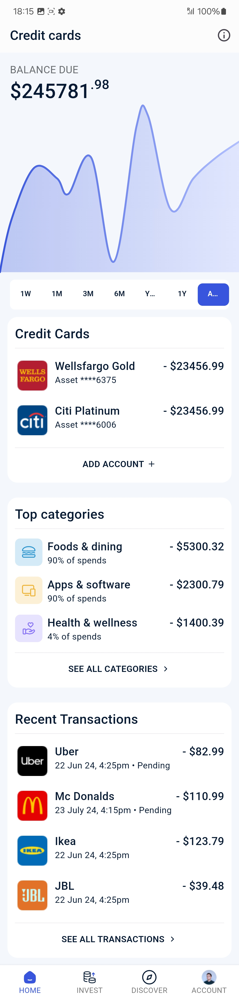

[# finvest

A Flutter project that follows the MVVM architecture pattern with Bloc for state management,
designed to be modular, reusable, and scalable. This project incorporates best practices for
architecture and design, making it maintainable and testable.

## Table of Contents

- [Overview](#overview)
- [Architecture](#architecture)
- [Features](#features)
- [Setup](#setup)
- [Screenshots & Screen Recording](#screenshots--screen-recording)

## Overview

This project is structured using the **MVVM pattern** with **Bloc** as the state management tool.
The codebase is modular, aiming to reduce repetitive tasks and improve maintainability. Key
functionalities are abstracted into base classes, making the app both scalable and easy to maintain.

## Architecture

### 1. **Architecture Setup**

- **MVVM Pattern with Bloc**: The app architecture is built around the MVVM pattern. Bloc handles
  state management, while the `BaseBloc` takes care of common functionalities across screens.
- **Modular Design**: The codebase is modular, enabling code reuse and improving maintainability.
  The `BaseStatelessWidget` is used to reduce repetitive tasks such as loading bars and exception
  handling across screens.
- **Dependency Injection**: Implemented using **get_it** and **injectable**, making the Bloc
  injection automatic for appropriate screens. This setup ensures high testability and scalability.

### 2. **Design Setup**

The design is being worked on currently. The initial screen designs will be completed shortly, and
further updates will follow.

## Features

- **BaseStatelessWidget**: Ensures code reuse across screens, reducing redundancy and improving
  maintainability.
- **Automatic Network Change Detector**: Dynamically updates the app's UI based on network status,
  ensuring the user is informed about connectivity changes.
- **Multiple Environment Support**: Supports UAT (User Acceptance Testing) and production
  environments, allowing seamless environment switching.
- **Design Best Practices**: Follows established UI/UX guidelines to maintain a consistent design
  throughout the app.

## Setup

To run this project, follow these steps:

1. Clone the repository:
   ```bash
   git clone https://github.com/kumarsiddy/finvest
2. Navigate to the project directory:
   ```cd finvest```
3. Install dependencies:
   ```flutter pub get```
4. Run the project:
   ```flutter run```

## Screenshots & Screen Recording

### Screenshot


<!-- Make sure to add the screenshot image file to the `screenshots` directory -->

### Screen Recording

[](./screenshots/recording.mp4)
<!-- Add the screen recording file to the `screenrecording` directory. A gif for preview and a link to the mp4 for full view -->

## Evaluation

The majority of the architectural setup is completed, including the integration of Bloc, dependency
injection, and automatic network handling. I've completed first screen UI design.

]()